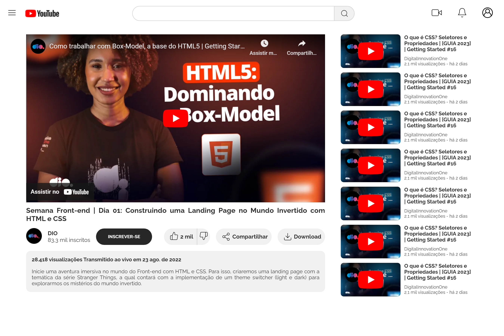

# Desafio CSS - Página do Youtube

Segundo desafio da Trilha de CSS da DIO! Recriei a página do Youtube com HTML e CSS, colocando em prática os fundamentos do CSS, as propriedades básicas da linguagem de estilização, FlexBox, além de trabalhar com as unidades de medidas relativas e absolutas que aprendi ao longo da trilha.

## 🚀 Demonstração

[Clique aqui](https://rafaelrfls.github.io/desafio-css-pagina-youtube/) para acessar o resultado final do projeto.

## 🛠️ Tecnologias Utilizadas

* [HTML](https://www.w3.org/html/) - Linguagem de Marcação
* [CSS](https://www.w3.org/Style/CSS/) - Linguagem de Estilização

<h2>📦 Temas abordados</h2>

- Fundamentos do CSS
- Flexbox

## ✒️ Autor

    
    
&nbsp&nbsp&nbspRafael Salvalagio Ghensev 
    &nbsp&nbsp&nbsp<a href="https://github.com/rafaelrfls">GitHub</a>&nbsp;|&nbsp;<a href="https://www.linkedin.com/in/rafael-salvalagio-ghensev-49671285/">LinkedIn</a>&nbsp;

